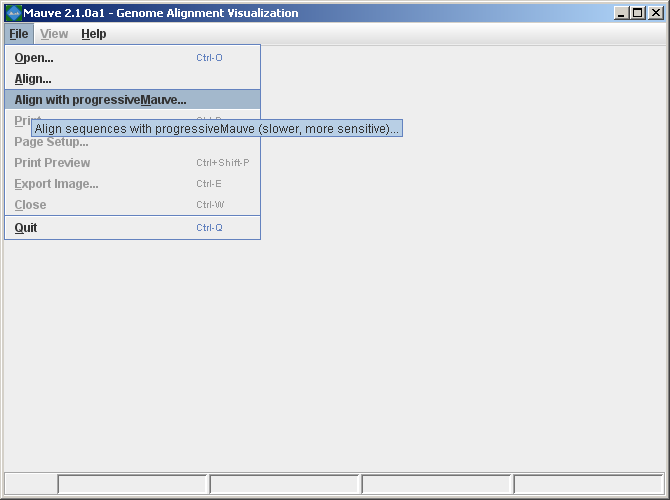
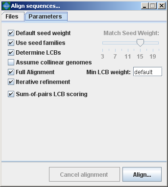

### Aligning genomes with Mauve

Mauve provides a simple user interface for aligning genomes. Once Mauve has started up, simply select "Align..." or "Align with progressiveMauve..." from the "File" menu.

 

Mauve then presents the alignment dialog box:

The following sections describe the various entry fields in the dialog box.

### Using the alignment dialog box

#### Sequence file input formats

Genome sequence files can be given to Mauve in any of FastA, Multi-FastA, GenBank flat file, or raw formats. Mauve deduces the file format based on the file name extension. By default, a file with any unrecognized file name extension is assumed to be in (Multi-)FastA format. Extensions recognized by Mauve are .gbk (GenBank), and .raw (raw sequence data). Note that some very old versions of Mauve (up to 20040219) also assume that .txt files are in raw format. FastA and GenBank format files with the genome of your organism can usually be downloaded from NCBI at [ftp://ftp.ncbi.nih.gov/genomes/](ftp://ftp.ncbi.nih.gov/genomes/). The .fna files are in FastA format and the .gbk files are in GenBank format.  For genomes with plasmids, mutliple .fna or .gbk files may need to be downloaded and concatenated into a single file (e.g. `cat *.gbk > my_genome.gbk`).

When an individual file contains several sequence entries, they will be concatenated and the whole concatenated sequence will be aligned to the sequences in the other files. This behavior allows multi-chromosomal genomes to be aligned by including all chromosomes in a single sequence file. Similarly, incomplete genomes that consist of several sequence contigs can be aligned, though beware that incorrectly ordered contigs will appear as genome rearrangements in the Mauve viewer.

Alternatively a single Multi-FastA file containing all the genomes to align can be specified. In this case Mauve assumes one genome per Multi-FastA sequence entry and will align the entries to each other.

#### Selecting Genomes to align

The top entry area lists the sequence file(s) containing the genomes that will be aligned. To add a sequence file, click the "Add sequence..." button and select the file to add. The Windows version of Mauve supports Drag-and-drop, allowing sequence files to be added by dragging them in from the windows explorer.

#### Setting an output location

The location where Mauve stores its alignment results can be set using the "File output:" text entry field. If left blank, Mauve will prompt for an output file location.

#### Setting custom alignment parameters

The alignment parameters are different between original Mauve (mauveAligner) and Progressive Mauve, and are discussed in more detail in a later section.

#### Computing the alignment

Once the genome sequences have been loaded, click the "Align..." button to start the alignment.  A console dialog will appear and will show the progress being made towards completing the alignment. 

The console window showing an in-progress genome alignment 

#### Cancel a running alignment 

As of version 2.1.0, it is possible to cancel a running alignment by returning to the "Align sequences..." dialog box and clicking the "Cancel alignment" button.  Alternatively, quitting the Mauve program should also kill the running alignment.  If all else fails, the running aligner (mauveAligner or progressiveMauve) can be killed using the Windows task manager, the Mac OS X process inspector, or the 'kill' command in unix.

### Progressive Mauve alignment parameters

By default, Mauve selects a set of alignment parameters that are appropriate for aligning closely related genomes with moderate to high amounts of genome rearrangement. However, some alignment parameters can (and should!) be adjusted to change Mauve's behavior. For example, the default value for Minimum LCB weight is often too low and should be replaced with a manually chosen value.  When aligning

#### progressiveMauve parameter descriptions:

##### Match seed weight
As with mauveAligner, the seed size parameter sets the minimum weight of the seed pattern used to generate local multiple alignments (matches) during the first pass of anchoring the alignment. When aligning divergent genomes or aligning more genomes simultaneously, lower seed weights may provide better sensitivity. However, because Mauve also requires the matching seeds must to be unique in each genome, setting this value too low will reduce sensitivity.

##### Default seed weight
Setting this option will allow Mauve to select an initial match seed weight that is appropriate for the length of sequences being aligned. The default seed size for 1MB genomes is typically around 11, is around 15 for 5MB genomes, and continues to grow with the size of the genomes being aligned. The defaults may be conservative (too large), especially when aligning more divergent genomes.  On the other hand, higher seed weights reduce noisy matching and can lead to better alignment in some cases.

##### Use seed families
Setting this option causes progressiveMauve to search for matches using three spaced seed patterns instead of just one.  Using three patterns can greatly improve sensitivity on diverged genomes, and permits using a higher seed weight for closely related organisms without loss of sensitivity.  Using seed families requires minor additional compute time in most cases.

##### Determine LCBs 
If this option is disabled Mauve will simply identify matches (local multiple alignments) among the genomes. See the description of match generation in the command-line interface chapter.

##### Assume collinear genomes 
Select this option if it is certain that there are no rearrangements among the genomes to be aligned. Using this option when aligning collinear genomes can speed up progressiveMauve's running time.

##### Full alignment and Iterative Refinement 
Selecting the "Full alignment" option causes Progressive Mauve to perform a recursive anchor search and a full gapped alignment of the genome sequences using MUSCLE.  If not selected, Progressive Mauve will identify alignment anchors cluster them into LCBs finish the alignment.  The "Iterative Refinement" option applies MUSCLE to refine the initial alignment, often improving the initial alignment.  As MUSCLE performs tree-independent iterative refinement, this option should be used to avoid biasing phylogenetic inference with a single guide tree.

##### Sum-of-pairs LCB scoring 
This option selects whether breakpoint penalties are applied among all pairs of extant sequences, or whether penalties are applied to inferred ancestral gene-ordering.  Since Progressive Mauve does not accurately infer ancestral gene orders, and even if it did, it does not infer ancestral genome content, this option should be considered "experimental" and should only be disabled when aligning collinear genomes.

### Original Mauve (mauveAligner) alignment parameters

By default, Mauve selects a set of alignment parameters that are appropriate for aligning closely related genomes with moderate to high amounts of genome rearrangement. However, some alignment parameters can (and should!) be adjusted to change Mauve's behavior. For example, the default value for Minimum LCB weight is often too low and should be replaced with a manually chosen value.  When aligning more divergent genomes, the seed size can be reduced to find additional alignment anchors and achieve greater alignment coverage over the genomes. Another option disables the full alignment process, allowing Mauve to quickly generate a comparative picture of genome organization.

 

The following sections describe the various entry fields in the dialog box.

#### mauveAligner parameter descriptions:

##### Match seed weight
The seed size parameter sets the minimum weight of the seed pattern used to generate local multiple alignments (matches) during the first pass of anchoring the alignment. When aligning divergent genomes or aligning more genomes simultaneously, lower seed weights may provide better sensitivity. However, because Mauve also requires the matching seeds must to be unique in each genome, setting this value too low will reduce sensitivity.

##### Default seed weight
Setting this option will allow Mauve to select an initial match seed weight that is appropriate for the length of sequences being aligned. The default seed size for 1MB genomes is typically around 11, is around 15 for 5MB genomes, and continues to grow with the size of the genomes being aligned. The defaults may be conservative (too large), especially when aligning more divergent genomes.  On the other hand, higher seed weights reduce noisy matching and can lead to better alignment in some cases.

##### Min LCB Weight 
The LCB weight sets the minimum number of matching nucleotides identified in a collinear region for that region to be considered true homology versus random similarity. Mauve uses an algorithm called greedy breakpoint elimination to compute a set of Locally Collinear Blocks (LCBs) that have the given minimum weight. By default an LCB weight of 3 times the seed size will be used.  The default value is often too low, however, and this value should be set manually.  The procedure to determine a reasonable value for the Min LCB Weight usually involves constructing an initial alignment with the default value, and then using the LCB weight slider in the Mauve GUI (see the next section) to find a weight that eliminates all spurious rearrangements.  The sequences can then be realigned using the manually determined weight value.

##### Determine LCBs 
If this option is disabled Mauve will simply identify matches (local multiple alignments) among the genomes. See the description of match generation in the command-line interface chapter.

##### Extend LCBs 
Controls whether mauveAligner will attempt to extend the range of existing LCBs and search for additional LCBs.  For some datasets, LCB extension can be very time-consuming and may not offer much improvement in the alignment.

##### Assume collinear genomes 
Select this option if it is certain that there are no rearrangements among the genomes to be aligned. Using this option when aligning collinear genomes can result in improved alignment accuracy.

##### Aligner 
Sets whether mauveAligner will utilize MUSCLE or ClustalW to compute global alignments between alignment anchors.  MUSCLE is the preferred choice, since it is faster and more accurate.

##### Island and Backbone sizes 
An island is a region of the alignment where one genome has a sequence element that one or more others lack. This parameter sets the alignment gap size used to calculate islands and backbone segments. See the description of the .islands and .backbone files below for more information.

##### Full alignment 
Selecting the "Full alignment" option causes Mauve to perform a recursive anchor search and a full gapped alignment of the genome sequences using the ClustalW or MUSCLE progressive alignment method. If not selected, Mauve will identify LCBs but will not do a recursive anchor search or progressive alignment.

 
