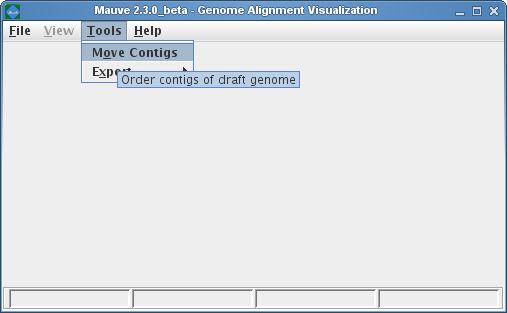
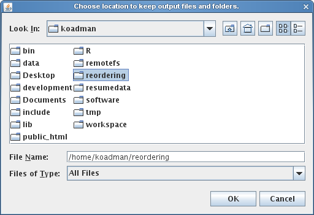
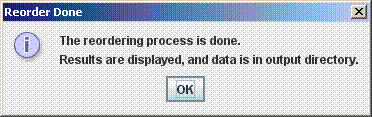

### When to use Mauve Contig Mover (MCM)

The Mauve Contig Mover (MCM) can be used to order a draft genome relative to a related reference genome.  The functionality of this software module has been described in [Rissman et al. 2009](http://bioinformatics.oxfordjournals.org/cgi/content/abstract/btp356), a publication in Bioinformatics. The Mauve Contig Mover can ease a comparative study between draft and reference sequences by ordering draft contigs according to the reference genome.  In many cases, true rearrangements in the draft relative to the reference can be identified.  The quality of the reorder is limited by the distance between the sequences, as indicated by the amount of shared gene content among the two organisms.  A more distant reference will usually yield fewer ordered draft genome contigs, and may also induce erroneous placements of draft contigs.  In addition to ordering contigs, MCM also orient them in the most likely orientation, and, if annotated sequence features are specified in an input file (e.g. with GenBank format input for the draft), MCM will output adjusted coordinates ranges for the features.

### Using Mauve Contig Mover

Mauve Contig Mover can be launched from the Tools->Order Contigs Menu of The Mauve Viewer.

 

Once the Mauve Contig Mover has been launched, it starts by requesting the user to specify an output directory.  MCM will create a series of mauve alignments in the output directory, structured into several subfolders, so creating a new, empty output folder is often best to minimize clutter.  The output directory selection is shown below.

 

Once the output directory has been set, a window similar to the Progressive Mauve Alignment Window appears.  Using the Progressive Mauve alignment window is described in more detail in the section "Constructing a genome alignment ", but when used for reordering contigs,  the following additional notes and constraints apply:
1.    Only two sequences should be entered.  The first must always be the reference, the second the draft genome to reorder.  The first may also be a draft, but only the second will be reordered.
2.    The reference genome may be in any of the allowable file formats, the draft must either be in a fasta or genbank file.  If the draft is in genbank format, a unique identifier must be specified in either the LOCUS tag of each contig.
3.    The alignment parameters have already been adjusted for what is generally best for draft genomes.  This may depend on the draft and reference, and can be adjusted if needed.

### The Reordering Process

The reordering will begin when the start button is pressed.  It is an iterative process, and may take anywhere from a half hour to several hours.  It may be cancelled at any point (intermediate results will be viewable).  If it is canceled after the first reorder the reordered draft genome will be available in a Multi-FastA file in the corresponding output directory, although an alignment of the canceled ordering step will not be present.  If the ordering process is not manually ended, it will terminate when it finds an order has repeated.  Sometimes the order will cycle through several possibilities; this indicates it cannot determine which of them is most likely. Alignment parameters may be changed before reorder starts or any time between alignments.
The following message will appear when the reorder process is complete:

 

### The MCM Output Files

MCM will output a series of folders called alignment1-alignmentX, representing each iteration of the reorder.  Each has the standard Mauve alignment files, as described in the section Mauve Output File Formats .  Each folder also has an additional file called name_of_genome_contigs.tab, where "name_of_genome" is the draft genome's name.  This file is included for ease of interpreting reorder results, and also acts as an index to the fasta as the contig orders and orientations change (even if the draft was originally input as a genbank, after the first alignment, it will be converted to a fasta with annotation information preserved in a file described below).  The file is divided into 3 sections, each containing a list of contigs.  The data for each contig includes its label (name), its location in the genome (numbered in pseudocoordinates from the first to last contig; these coordinates can be entered into the View->Go To->Sequence Position menu option to jump to that contig using the Mauve Alignment Viewer), and whether it is oriented the same as originally input, or was complemented.  The three sections are described below:

1.    Contigs to reverse:  This section contains contigs whose order is reversed with respect to the previous iteration.  Note that contigs in this section may be oriented the same as originally input, this can be determined from the forward orcomplement designation.

2.    Ordered Contings:    This is a list of all the contigs in the order and orientation they appear in the fasta for the draft of this iteration of the reorder.  Since these include all the contigs in the original input, those with no ordering information (no aligned region) will be clustered at the end.  These will appear as contigs with no LCBs at the end of the draft genome.

3.    Contigs with Conflicting Order information:    This is a list of contigs containing LCBs suggesting multiple possible locations.  These may be of interest to verify positioning, or to look at points of potential rearrangement or misassembly.

If the draft was input as an annotated genbank file, a second file will appear in each alignment folder called name_of_genome_features.tab.  This file will contain a line for each annotation, information about its current orientation and location (which will change if the contig is inverted), coordinates from the previous iteration (indicating relative orientation), and whether it is reversed from the original input.  It will also have a label field used to identify each feature.  This will be gotten from the annotation, as checked in the following order:  db_xref, label, gene, and locus_tag.

Thus, the folder with the highest numbered alignment contains a fasta and one (or possibly two) descriptor files representing the final order of the draft genome.

### Reordering contigs from the command-line (batch mode)
In situations where it is necessary to order contigs in a large number of draft genomes it is often more desirable to automate the process using command-line interfaces and scripts. Mauve Contig Mover supports command-line operation through the Mauve Java JAR file.  

Given a reference genome file called "reference.gbk" and a draft genome called "draft.fasta", one would invoke the reorder program with the following syntax:

	java -Xmx500m -cp Mauve.jar org.gel.mauve.contigs.ContigOrderer -output results_dir -ref reference.gbk -draft draft.fasta

The file Mauve.jar is part of the Mauve distribution.  On windows systems it can usually be found in C:\Program Files\Mauve X\Mauve.jar where X is the version of Mauve.  On Mac OS X it is located inside the Mauve application.  For example, if Mauve has been placed in the OS X applications folder, Mauve.jar can be found at /Applications/Mauve.app/Contents/Resources/Java/Mauve.jar.  On Linux, Mauve.jar is simply at the top level of the tar.gz archive.  In the above example command, it will be necessary to specify the full path to the Mauve.jar file.

