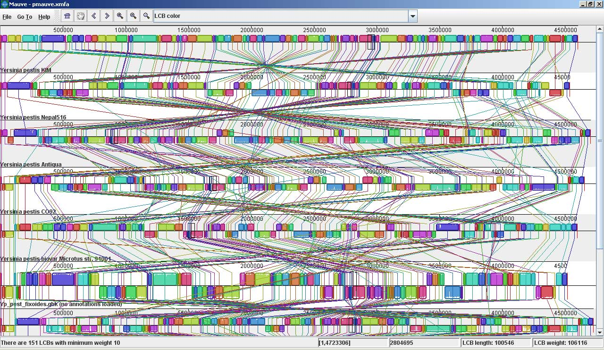
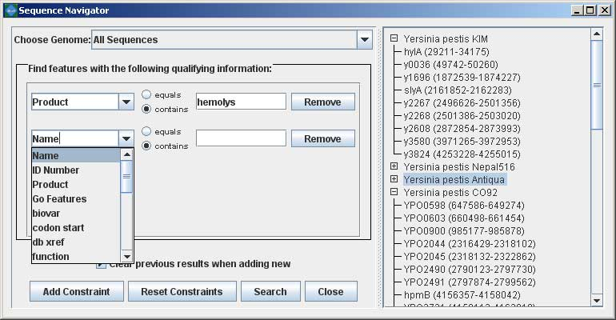
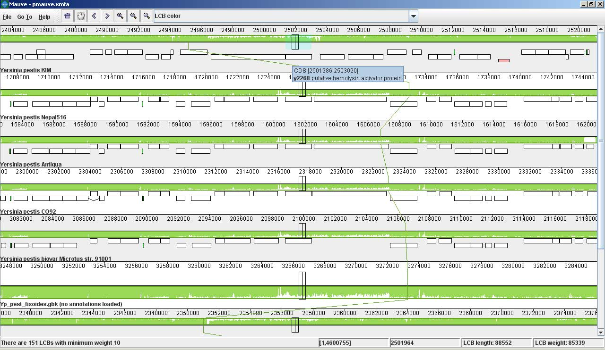
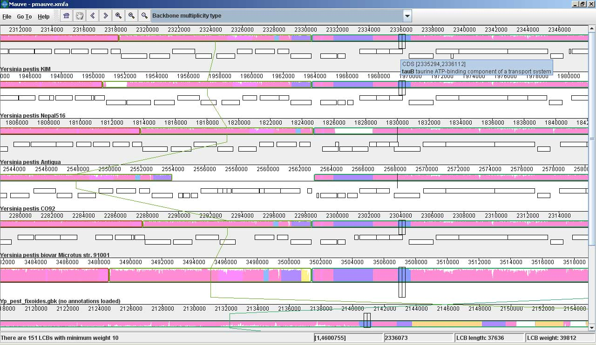

### Mauve screenshots

These screenshots were taken with Mauve 2.0 visualizing an alignment of nine _Yersinia_ genomes. 

The first is a screenshot of Mauve 2.0 visualizing the global rearrangement structure of the chromosomes:

[[+] click to enlarge](rearrangements.jpg)

Each genome is laid out horizontally and homologous segments are shown as colored blocks that are connected across genomes.  Blocks that are shifted downward in any genome represent segments that are inverted relative to the reference genome (_Yersinia pestis_ KIM).  Clicking in the display will vertically align the homologous segment in each genome.

[[+] click to enlarge](seqnav.jpg)

Mauve 2.0 has a powerful interface to search genome annotation.  Annotations can be searched by CDS name, amino acid sequence, Gene Ontology information and other fields.  In this example, we search for genes that encode products related to hemolysin, a compound associated with the _Yersinia_'s pathogenicity.

Now, if we click on one of the hemolysin search results (y2268), we get this view in Mauve: 

[[+] click to enlarge](hemolysin.jpg)

Mauve 2.0 visualization of a gene which codes for a putative hemolysin activator protein.  Annotated CDS (genes) are shown as white rectangles, with genes transcribed from the reverse strand shifted downward.  The mouse cursor is shown as a black vertical bar and box that identifies the location of the hemolysin-related gene in each of the _Yersinia_ genomes.  The average sequence identity in the alignment is proportional to the height of the colored region.  From the display, it is obvious that the hemolysin-related gene has lower average sequence identity than surrounding genes, possibly due to an evolutionary pressure such as diversifying selection.

Large insertions and deletions are quite common in some bacterial genomes:

[[+] click to enlarge](bb_mult_type.jpg)

This image shows Mauve 2.0 in "backbone color."  Regions that are conserved among all nine _Yersinia_ are shown in pink (mauve) color.  Regions conserved only among subsets of the genomes have been color coded differently.  The tauB gene appears to have been suffered a lineage-specific deletion in the _Yersinia pestis_ Antiqua genome.
