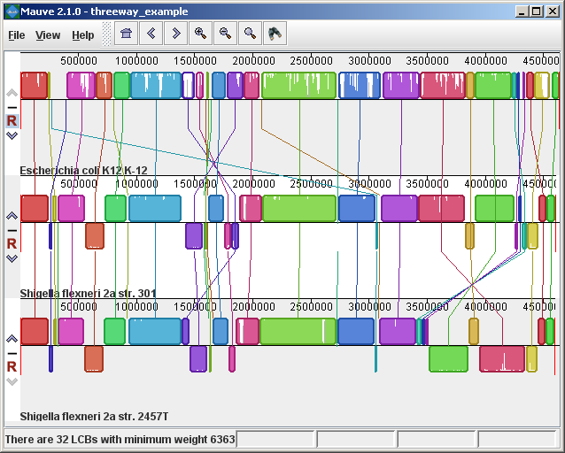

### The display layout

The alignment display is organized into one horizontal "panel" per input genome sequence. Each genome's panel contains the name of the genome sequence, a scale showing the sequence coordinates for that genome, and a single black horizontal center line. Colored block outlines appear above and possibly below the center line. Each of these block outlines surrounds a region of the genome sequence that aligned to part of another genome, and is presumably homologous and internally free from genomic rearrangement. When a block lies above the center line the aligned region is in the forward orientation relative to the first genome sequence. Blocks below the center line indicate regions that align in the reverse complement (inverse) orientation. Regions outside blocks lack detectable homology among the input genomes.  Inside each block Mauve draws a similarity profile of the genome sequence. The height of the similarity profile corresponds to the average level of conservation in that region of the genome sequence. Areas that are completely white were not aligned and probably contain sequence elements specific to a particular genome. The height of the similarity profile is calculated to be inversely proportional to the average alignment column entropy over a region of the alignment.

Figure 1 (above) shows an alignment of _E. coli_ K12 MG1655, _S. flexneri_ 2a 301, and _S. flexneri_ 2457T. Notice how inverted regions in the _S. flexneri_ are clearly depicted as blocks below a genome's center line.  These three genomes were taken from the NCBI FTP site and aligned with Progressive Mauve using default parameters, as described in the previous section.

In Figure 1, colored blocks in the first genome are connected by lines to similarly colored blocks in the second and third genomes. These lines indicate which regions in each genome are homologous. Notice the crossing "X" pattern of lines, which happen to occur in the vicinity of the predicted origin and terminus of replication in these organisms.  When viewing genomes with complex rearrangements, the LCB connecting lines can be confusing and they can be hidden (or made visible again) by typing **Shift+L** (pressing shift and L simultaneously) or using the "View" menu.

In the standard color scheme, the region of sequence covered by a colored block is entirely collinear and homologous among the genomes. The boundaries of colored blocks usually indicate the breakpoints of genome rearrangement, unless sequence has been gained or lost in the breakpoint region. 

#### The Backbone color scheme

When an alignment has been computed with Progressive Mauve,  a display mode is available that colors regions conserved among all genomes differently than regions conserved among subsets of the genomes.  We term regions conserved among all genomes as "backbone," which are drawn in mauve color.  Applying the color mode to the alignment of three _E. coli_ and _Shigella_, and disabling LCB outlines in the "View->Style" menu yields:

Figure 2 (above) shows the same alignment of _E. coli_ K12 MG1655, _S. flexneri_ 2a 301, and _S. flexneri_ 2457T, but displayed with different style settings. Parts of the similarity plot which are colored mauve are conserved among all three genomes, while portions colored green are segments conserved only among the _Shigella flexneri_.  Segments conserved among _E. coli_ and _S. flexneri_ 2457T are colored brown, but are too small to notice in a whole-genome view (see below).  The black box follows the mouse cursor and highlights the homologous site in each genome.  Clicking the similarity plot will line up orthologous regions

#### Zooming in on Annotated Features

If the aligned genome sequences were in GenBank files containing annotated features Mauve will display the annotated features next to the sequence similarity profiles. For efficiency reasons, annotated features appear only when less than 1Mbp of sequence is being displayed.  To zoom in on the alignment, either use the magnifying glass buttons from the toolbar, or use the keyboard shortcuts **Ctrl+Up** to zoom in (press Control and up arrow key simultaneously) and **Ctrl+Down** to zoom out. On Mac OS X, all of these shortcuts use the **Command** key instead, so zooming in is **Command+Up** etc.  Once viewing less than 1Mbp of sequence, annotated CDS features show up as white boxes, tRNAs are green, rRNAs are red, and misc_RNA features are blue. Mauve displays the /product qualifier when the mouse cursor is held over a feature. When a feature is clicked, Mauve shows a detailed listing of feature qualifiers in a popup window, in addition to a menu that links to the NCBI Entrez protein entry corresponding to the gene.

Figure 3 (above) shows the same alignment zoomed in on a region 3.85Mbp into the _E. coli_ K12 genome where the gene emrD is encoded.  Annotated genes are shown as white boxes, with genes transcribed from the reverse strand shifted downward.  The mouse cursor (shown as a black line) is hovering over the emrD CDS in _E. coli_ K12.  The similarity plot for the N-terminal end of the gene and the upstream region is colored brown, indicating that the segment of DNA is missing from the _S. flexneri_ 2a 301 isolate.  The segmental deletion could potentially have consequences for gene regulation in this _S. flexneri_ 2a 301.

### Navigating the display

#### Zooming and shifting the display

The alignment display is interactive, providing the ability to zoom in on particular regions and shift the display to the left and right. Navigating through the alignment visualization can be accomplished by using the magnifying glass and arrow control buttons on the toolbar immediately above the display. Alternatively, keyboard shortcuts allow rapid movement through the alignment display. The keystrokes Ctrl+up arrow and Ctrl+down arrow zoom the display in and out, while **Ctrl+left** arrow and **Ctrl+right** arrow shift left and right, respectively (Command+left or Command+right on the mac).  Holding down the "shift" key with Ctrl+left and Ctrl+right accelerates the shifting leftward and rightward.

#### Mouse control

When moving the mouse over the alignment display Mauve will highlight the aligned and homologous sites of each genome with a black vertical bar. By clicking the mouse in the sequence similarity plot, Mauve will line up the positionally homologous sites of each genome.  Finally, a portion of the alignment can be selected by clicking and dragging over the similarity plot while holding down the "shift" key. 

#### Reordering sequences and changing the reference genome

When viewing alignments of many genomes, it is often desirable to reorder the genome sequences.  This can be accomplished by clicking the up and down arrow buttons to the left of each genome.  By default, Mauve uses the first genome sequence as the reference genome for assigning a reference orientation to inverted blocks.  The reference genome can be changed by clicking the "R" button for the desired reference sequence, also to the left of the genome sequence display.  The following figure shows the alignment of three _E. coli_ and _Shigella_ after it has been reordered and the reference was changed:

#### Hiding sequences

When viewing an alignment with a large number of genome sequences, it can be helpful to simplify the view by restricting the display to genomes of interest.  This can be accomplished by clicking the minus button at the left of the display.  For example, here is a view of an alignment of 21 genomes, with many of them hidden from view.

#### Searching for annotated features

Every good molecular biologist has a favorite gene.  Since version 2.0.0, Mauve has a convenient interface to make finding your favorite gene easy.  Annotation can be searched by by gene name, product description, amino acid sequence, and other information.  The search feature can be activated by clicking on the binoculars button in the toolbar, or through the "View->Go To->Find Features" menu item.  Mauve will then present a search interface window:

In the present example, the alignment of three _E. coli_ and _Shigella_ has been searched for genes that encode products related to penicillin.  The search results for each genome are shown at right.  A particular gene, dacC has been selected.  When dacC is clicked, the display refocuses itself onto the region surrounding the dacC gene, which is highlighted in light blue:

Interestingly, the penicillin binding protein encoded by dacC appears to have been pseudogenized in the _Shigella_ genomes.   Inspection of the surrounding region reveals two CDS annotated as IS600, a well known transposable element that has colonized the _Shigella_.  The IS600 has inserted itself near the end of the dacC gene.

#### Creating publication quality graphics with Mauve

Although Mauve offers a means to export an image file of the current display, using the "File->Export Image..." menu item, the exported images are raster graphics and may not be ideal for journal publication.  To create publication quality EPS or PDF graphics with Mauve, it is better to print directly to a postscript file or a PDF.  This is done by selecting "File->Print" and then choosing a PDF or postscript output from the print dialog.  On Mac OS X, there is an option in the print dialog to "Save to PDF" which can easily be used.  Under Windows, there is no built in PDF renderer, although several third-parties sell software with this feature.  Adobe Acrobat includes a PDF renderer, and companies such as [CutePDF](http://www.cutepdf.com/products/cutepdf/writer.asp) and [pdf995](http://www.pdf995.com) offer free PDF rendering software.  Another option is to use the "Print to file..." checkbox in the windows print dialog.  If a postscript printer driver has been installed, the resulting file will be in postscript (EPS) format.  A postscript printer driver can be installed in Windows without actually connecting a real printer, by going to the Printers control panel, and choosing "Add printer."  Select a "local printer attached to this computer" and do not "Automatically detect and install my Plug and Play printer".  Click Next.  Select "Use the following port" and select "FILE: (Print to File)".  Click Next.  When prompted for a printer model, select Apple Color LW 12/660 PS.  Click Next.  Choose a printer name and you're done.

Once a postscript or PDF file has been created, it is often desirable to edit the file.  The best program to do so is [Adobe Illustrator](http://www.adobe.com/products/illustrator.html), as it has been designed for editing vector graphics files such as postscript and PDF.  Alternative graphics editing software such as the open-source [Inkscape](https://inkscape.org) may be worth investigating.

While it may seem like a hassle to process Mauve images in vector formats like PDF or EPS, your effort will be rewarded with crisp print quality that far exceeds a grainy and pixelated screenshot.  Moreover, Mauve graphics in PDF or EPS format can be scaled to print in large multi-page formats or on posters without loss of visual quality. 

#### Exporting sets of positionally positionally homologous features (genes, CDS, tRNA, and so on)

Beginning with version 2.3.0, Mauve has the ability to identify sets of positionally homologous sequence features and export a list of such annotated features.  Annotated features can be CDS, gene, rRNA, tRNA, or misc_RNA.  With an alignment generated by progressiveMauve, the positionally homologs can be exported by selecting "Tools->Export->Export Positional Orthologs" from the menu.  A window will then appear requesting the location to save the positionally homologs output file(s) along with some configurable parameters for the positionally homologs identification algorithm.  One parameter is the permissible range of nucleotide identity for positionally homologs sequences.  To be called as positionally homologs, a pair of annotated features must have an average pairwise nucleotide identity within the specified range.  The nucleotide identity is calculated only over conserved regions shared by the pair of annotated features, not including large gaps.  A second parameter is the "coverage" of the pair of annotated features in the alignment.  The coverage is calculated as the fraction of a feature that is aligned to the other feature.  If X% of the length of feature A is aligned to feature B, and Y% of the length of B is aligned to feature A, and X and Y are both within the user-specified range of allowable coverage, then A and B will be considered positionally homologs.

Once Mauve has identified all pairs of positionally homologous features in the input genomes, it then applies transitivity to the positional homolog predictions.  If A is found homologous to B, and B to C, then A must also be homologous to C, even if A and C do not meet the nucleotide identity or coverage requirements specified above. 

##### Why are these positional homologs and not orthologs?
It has been argued in the literature that the evolutionary relationship of orthology can not be applied transitively.  This is true in general, and for this reason one should consider positionally homologous features inferred by Mauve as just that: inferences, which could be incorrect in some cases.  Frequently homologous genes located in the same chromosomal context will indeed be orthologs and so inference of orthologs by transitive application of orthology will usually yield correct results.  But occasionally evolutionary processes such as gene conversion with duplicate gene copies may create a situation where the positional homolog is a paralog.  For this reason we suggest that users of the positional homolog export feature exercise caution when interpreting the evolutionary history of homologs generated by Mauve. In previous versions of this document and in the software, these features are called "positional orthologs". This description has been revised to "positional homologs" to help clarify that some exported features may have evolutionary histories that are not consistent with orthology.

In addition to parameters controlling the positional homolog inference procedure, the export window contains an option to output a file of multiple alignments corresponding to each positional homolog set. The /locus_tag qualifier of GenBank annotations is used to give names for features in the output files. 

#### Keyboard control reference 

| **Function** | **Keystroke** |
| ---------|-----------|
| Zoom in  | Ctrl + Up |
| Zoom out | Ctrl + Down |
| Scroll display left | Ctrl + Left |
| Scroll display right | Ctrl + Right |
| Large left scroll | Shift + Ctrl + Left |
| Large right scroll | Shift + Ctrl + Right |
| Open an existing alignment file | Ctrl + O |
| Print the current view | Ctrl + P |
| Set the page layout for printing | Ctrl + Shift + P |
| Export the current view as an image | Ctrl + E |
| Close the current alignment window  | Ctrl + W |
| Quit Mauve | Ctrl + Q |
| Show or hide LCB connecting lines | Shift + L |
| Show or hide LCB outlines | q |

Note: On Mac OS X the **Command** key must be used instead of the control key in the above keyboard shortcuts.

#### Other Color Schemes

When the "Full Alignment" option has been disabled, several color schemes become available. These color schemes are not available when viewing a full alignment with a similarity profile display.

##### LCB Color

 Each locally collinear block (LCB) is assigned a unique color.

##### Multiplicity Color

 Matches are colored differently based on their Multiplicity, where Multiplicity is defined as the number of matching genomes. e.g. A match with multiplicity=5 indicates that 5 genomes contain that homologous region of sequence.

##### Multiplicity Type Color

 Matches are colored differently based on which genomes they match in, or their multiplicity type. For example, regions that match in genomes A, B, and D would be colored differently than regions matching in B, C, and D, even though the matches have the same multiplicity. The normalized version of multiplicity type color mode makes the colors used more distinguishable by eliminating unused multiplicity types from the color palette.

##### Offset Color

 Matches are colored based on their generalized offset. The generalized offset is a number that summarizes the relative positioning of the match in each genome. Matches with similar generalized offsets will generally be collinear with each other. Thus regions of potential collinearity can be visualized using this color mode without actually performing LCB detection. This can be especially useful when comparing a large set of diverse genomes because the current implementation of LCB detection doesn't identify rearranged regions that exist in only a subset of the genomes being aligned. With offset color, such regions will appear as a continuously colored region in the Mauve viewer.
