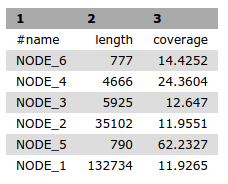

# Assemble an Illumina paired-end dataset with SPAdes

This tutorial assumes you have a Microbial GVL instance running already in the NeCTAR (or Amazon) cloud.
See the "[Initial setup](gvlsetup)" page for instructions on how to get that going.

## Obtain the example data

Download the example datasets:

* [Read 1](http://darlinglab.org/tutorials/data/mutant_R1.fastq.gz)
* [Read 2](http://darlinglab.org/tutorials/data/mutant_R2.fastq.gz)

These files contain paired-end Illumina reads that were generated via computational simulation for teaching purposes -- these are not real data.

Just save them wherever is convenient.

## Upload the files to the GVL system

1. Click the "Get Data" -> "Upload File From Your Computer" links at the left side of the page
2. Click the "Choose local file" button and select the two sequence files you just downloaded
3. Click the "Start" button

## Launch the assembly

1. Click the "NGS: Assembly" link at left
2. Scroll down and select "spades" in the left side drop down menu
3. In the "Libraries" section, check that the correct files are listed. "mutant_R1.fastq" should be the forward reads file, and "mutant_R2.fastq" should be the reverse reads file. 
4. Click the "Execute" button
5. Be patient. Go for a short walk. Sitting is the new smoking.
6. Upon completion, the status tabs in the right sidebar will turn green and results can be viewed by clicking the eye icon.

If this has worked, the assembly should have 6 contigs and scaffolds, with the following sizes & coverage levels:

