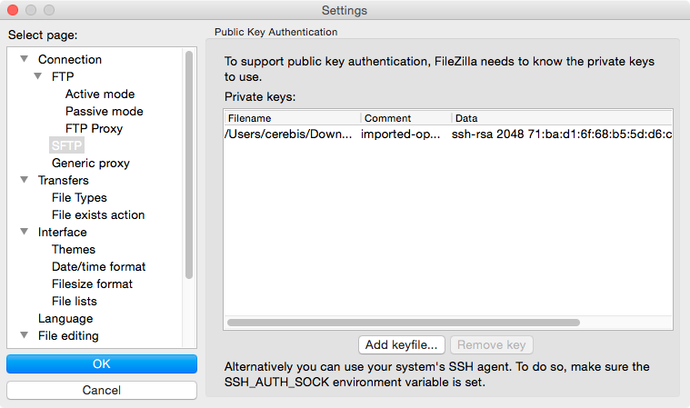

#FileZilla Access to NeCTAR

To access a running instance using FileZilla, you need two things.

1. Your private key used in creating the instance.
2. The public IP address of the instance.

The IP address of your instance can be found on the __Instances__ tab of the NeCTAR dashboard. This IP address is randomly assigned each time an instance is started, make sure you use the up to date value.

The private key was downloaded, via your browser, when the public/privte key pair was created on the NeCTAR website. You may have created it long before you created the instance you intend to use. It is best to place your private keys somewhere you can find them and not just left in a download folder. This is a sensitive piece of information. You should restrict its permissions to readable only by yourself. Some communication clients will insist on that you do this prior to connecting. This file has the same name as the key-pair, with a .pem suffix.

Eg. my-key.pem

Once you find the correct private key file, go to __FileZilla => Settings => Connection => SFTP.__

Select, _Add keyfile..._ and select your private key. FileZilla might ask to convert the fileformat, this is ok and you can say yes.

Once the key as been added, you are now ready to create a connection.

In FileZilla, go to __File => Site Manager__

1. Add a __"New Site"__.
2. Copy and paste the NeCTAR instance IP address into the Host box.
3. Set the protocol to SFTP.
4. Select __"Interactive"__ logon type.
5. For GVL, the default user is __"root"__. Unfortunately, this can vary with image.
6. Hit __"Connect"__.

In the small message log window, you should see FileZilla and your running instance communicating. After a brief period, the __"Remote site"__ section of FileZilla should populate with the directory structure on the remote system. The message log should finish with __"Directory listing successful"__.

Congratulations, you have now connected to your remote instance. You can copy files back and forth.
