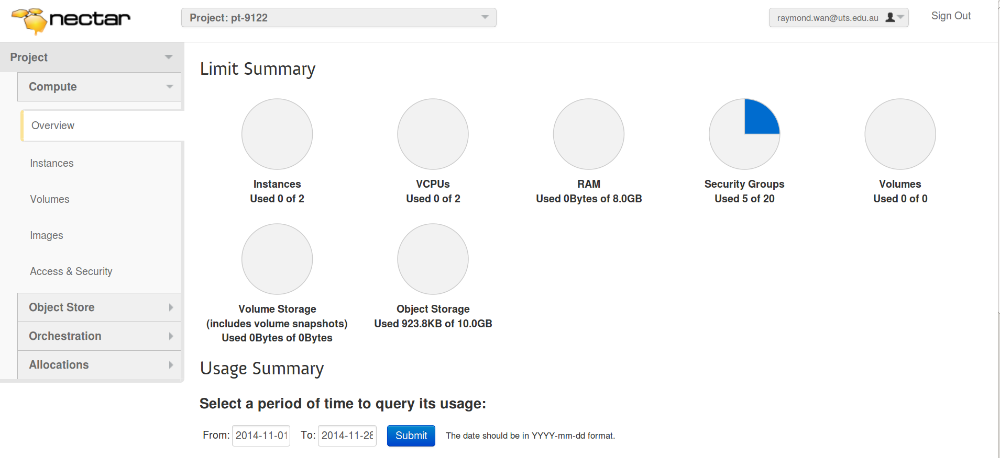
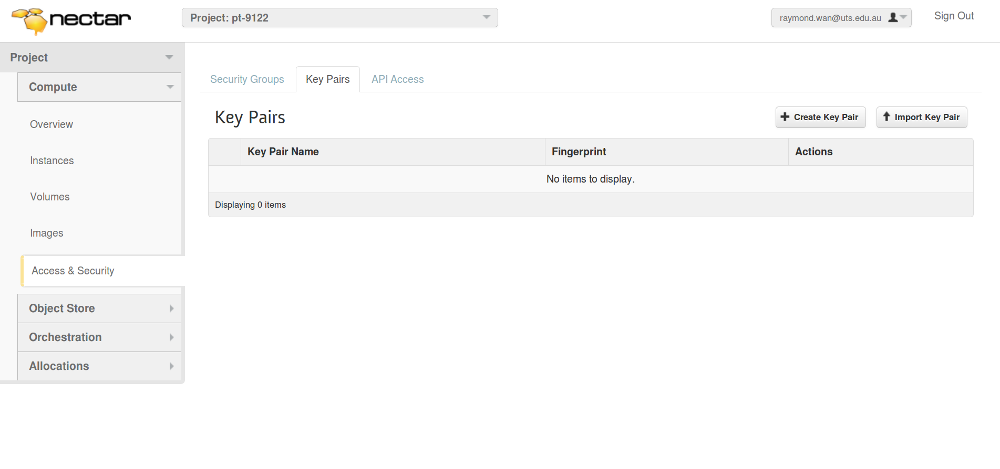
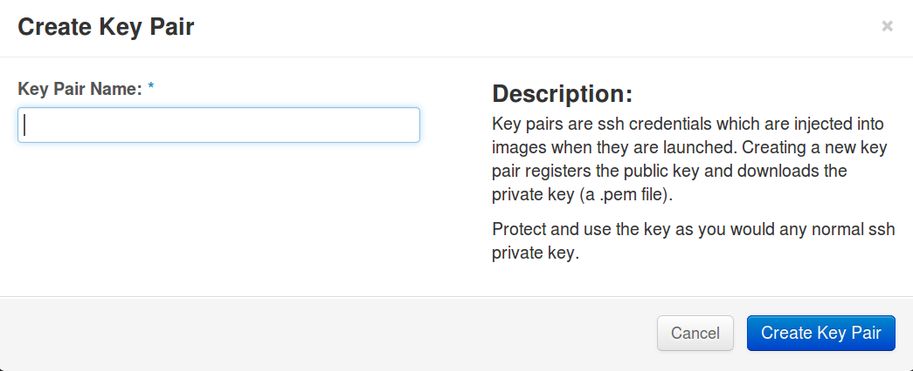
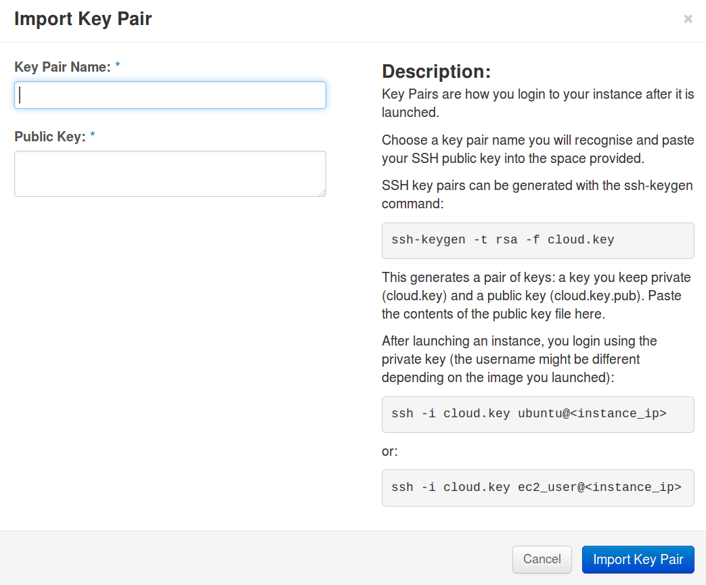
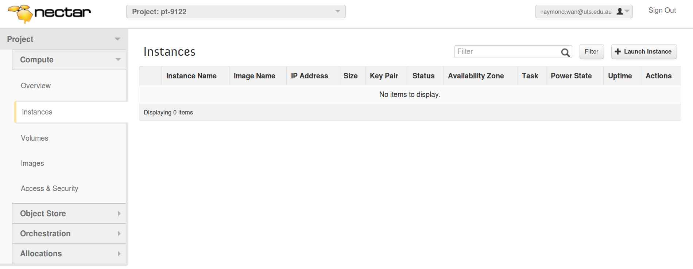
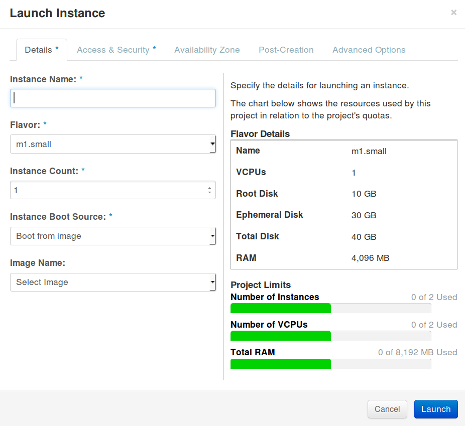
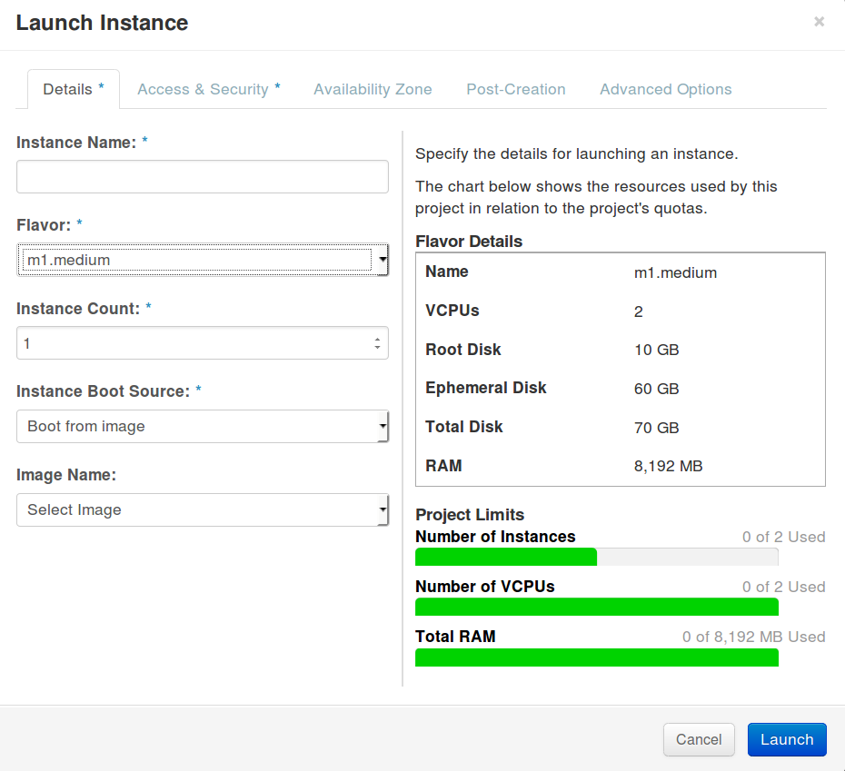
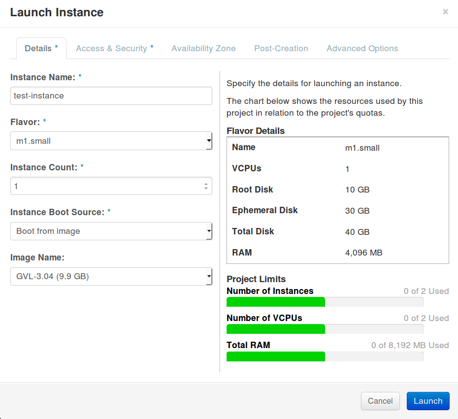
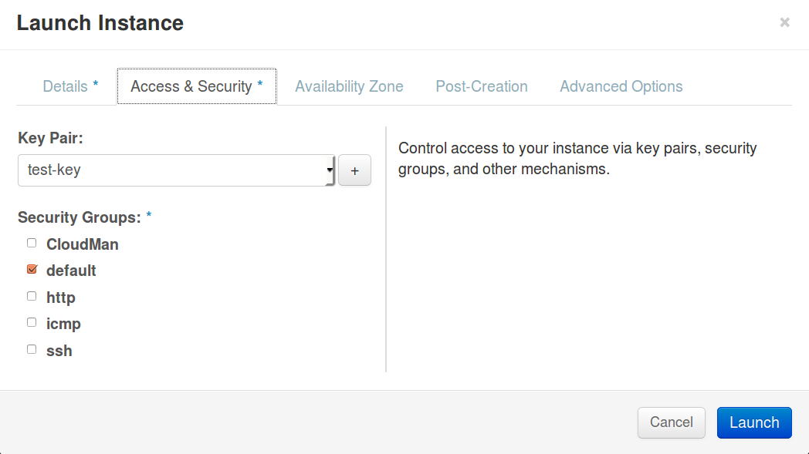
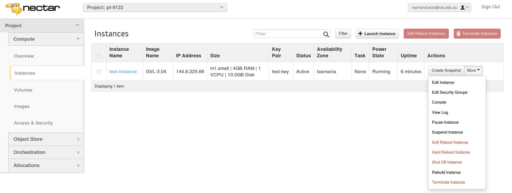

Begin by logging in at the [NeCTAR dashboard](https://dashboard.rc.nectar.org.au/).  After logging in, you should see the "Overview" page:



On this page, the amount of resources that you are currently using is shown.  This includes the number of instances you can run, the total memory that you can use for your instances, etc.

#Access Control

Key-pairs replace passwords in the cloud environment. Key-pairs can be either created on the NeCTAR website under "_Access & Security_" or created on your local computer using the ```ssh-keygen``` command and imported into NeCTAR via the same link.

So, click on "_Access & Security_" and then the "_Key Pairs_" tab at the top:



Key-pairs come in two parts:  a private key and a public key.  If one of these two parts is mistakenly deleted or lost, then the key-pair is useless and you will need to generate a new one.

If you have at least one key listed here __and__ you know that you have not lost the either part of it, then you can move to the next section, "Starting an instance on NeCTAR".  The key-pair cannot be easily changed after launch. If you created the instance with a key-pair for which you no longer possess the private-key, there will be no way to log into the system. In this situation you should terminate the instance.

From this screen, you either create a key pair or import an existing one using either of the buttons in the top-right.

If you want to use NeCTAR to create a new key-pair, then click on "_Create Key Pair_" opens up a small window where you can name and then download the private key:



If you have a key-pair already, then you can import it into NeCTAR by selecting "_Import Key Pair_":



Provide a name and copy and paste the __public key__ into the space given. 

#Starting an instance on NeCTAR

Select "_Instances_" from the menu on the left:



Then select "_Launch Instance_" from the top-right.


##1) Choose a flavor.

A __flavor__ refers to a combination of resources such as memory, disk space, CPUs, etc.  Based on the project you've been assigned to, you can create instances with certain limits.  Compare the two below between the m1.small flavor and the m1.medium flavor:




Here, I'm permitted to use 8,192 MB of memory and 2 virtual CPUs (VCPUs).  Thus, I can create two m1.small flavors or one m1.medium flavor.

##2) Give a name to the instance so that you can identify it easier if you have more than one instance created.

##3) Choose an image. 

For bioinformatics work, Genomics Virtual Laboratory (GVL) is a good choice. You can find the various releases of this image under the Dashboard's "_Images_" tab or in the "select image" drop down menu when launching an image. Unless otherwise required, using the latest image (highest version number) is best.



You might also consider starting from a snapshot -- an backup of an image that may already contain additional software or data you wish to use. Snapshots can be shared amongst users, maybe someone you know can save you some time by sharing a snapshot with you.

##3) A public/private key pair

Select the "_Access and Security_" tab.  From the Key Pair selection box, select a key pair.  If no key pair exists, then "_Cancel_" what you are doing and double-check that a key pair exists.  Return to the section above entitled "_Access Control_".



It is important to treat any private key as sensitive information. Although it is not transmitted over the network during authentication, it is still used to prove your identity. Its access permissions should be restricted to you alone. In fact, some clients will insist that permissions be restricted to the file owner only or refuse to execute (IE. ssh).

The following command sets the permissions of file to be readable only by the owner.
```bash
chmod 0400 [key-file]
```

##4) Set the Security Group

Instances start-up following a policy for security set out by a "_Security Group_". This is a way of collecting a bunch of rules, which effect the security of your instance under a single banner. In NeCTAR, these refer to whether specific network ports (entryways of communication between computers) are open or closed. By default, all ports are closed.

|Port|Access Type|
|----|-----------|
| 22 | SSH |
| 80 | HTTP/web |
| 443 | secure HTTP/web |

Security groups and their rules can be changed after an image has been launched. If you forget to enable a port, you can always add this rule afterwards.

##5) Launch the instance

Now that you have attended to points 1-3, you can launch the instance. It will take anywhere from a few to perhaps 30 minutes depending on system load and instance size. You do not need to stay on the NeCTAR webpage once the process has gotten underway. The instance will complete initialization and remain waiting for you once ready.

#Connecting to the instance with SSH.

From the NeCTAR Dashboard, copy the IP address to your clipboard. You must use an SSH client which supports connections using a private key. On some GUI based clients, this open is buried in the settings menu.

To conenct with the standard command line tool:

```bash
ssh -i [my-private-key] ubuntu@[instance-ip-address]
```

Where you must replace [my-private-key] with the path to your private key used when launching the instance and [instance-ip-address] is the IP addres you copied from the NeCTAR Dashboard.

If you have problems accessing your system, consider adding -v to the __ssh__ command.  This produces more verbose output.  You can add more -v (up to 3, depending on the ssh version), to increase the level of output.

#Finishing up

If you return to the "_Instance_" menu item, you should see the status of all of your instances.

Here, you can also select "Create Snapshot" to create a backup of the instance.

If you select "More", then you can perform other tasks such as restarting or terminating the instance:




