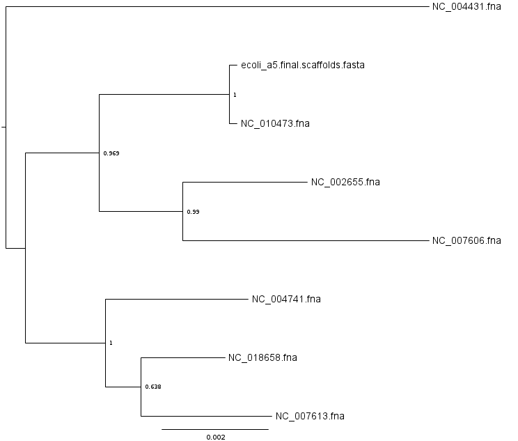

# Constructing a genome phylogeny using marker genes

In this tutorial we will collect several finished and draft genomes and construct a marker gene based genome phylogeny from them.

This tutorial assumes you have a GVL instance running already in the NeCTAR cloud.
See the "[Initial setup](gvlsetup)" page for instructions on how to get that going.

Alternatively you can run any of these commands inside a Linux or Mac OS X terminal. 
This _will not_ work on Windows, not even with cygwin. Use NeCTAR instead.

The genome phylogenies produced by this approach are useful as a rough guide to the evolutionary history of any draft genomes
you might have just sequenced or otherwise obtained. Careful inference of clonal descent is more involved and should be
undertaken once it's clear which collection of isolate genomes would be appropriate for such an analysis.

## Obtain the example data

Once logged into the cloud instance, create a new directory to work from:

    sudo mkdir /mnt/phylogeny ; sudo chown ubuntu /mnt/phylogeny ; cd /mnt/phylogeny
    curl http://darlinglab.org/tutorials/phylosiftrc > ~/.phylosiftrc

Note that the above instructions are _only_ relevant to operation in a NeCTAR cloud instance, and should **not** be used on your own laptop.
The second command above installs a phylosift configuration file which specifies that phylosift should use the transient storage in /mnt to store its database. This is necessary on NeCTAR cloud instances because the root partition (perhaps stupidly) is not configured with much free disk space.

Download the following finished genomes from NCBI:

    curl -O ftp://ftp.ncbi.nih.gov/genomes/Bacteria/Escherichia_coli_O157_H7_EDL933_uid57831/NC_002655.fna
    curl -O ftp://ftp.ncbi.nih.gov/genomes/Bacteria/Escherichia_coli_CFT073_uid57915/NC_004431.fna
    curl -O ftp://ftp.ncbi.nih.gov/genomes/Bacteria/Escherichia_coli_K_12_substr__DH10B_uid58979/NC_010473.fna
    curl -O ftp://ftp.ncbi.nih.gov/genomes/Bacteria/Escherichia_coli_O104_H4_2011C_3493_uid176127/NC_018658.fna
    curl -O ftp://ftp.ncbi.nih.gov/genomes/Bacteria/Shigella_flexneri_2a_2457T_uid57991/NC_004741.fna
    curl -O ftp://ftp.ncbi.nih.gov/genomes/Bacteria/Shigella_boydii_Sb227_uid58215/NC_007613.fna
    curl -O ftp://ftp.ncbi.nih.gov/genomes/Bacteria/Shigella_dysenteriae_Sd197_uid58213/NC_007606.fna
    

The above commands can be copy & pasted into a terminal.
Now obtain the following draft genome:

    curl -O http://darlinglab.org/data/marker_phylogeny/ecoli_a5.final.scaffolds.fasta
    

The above collection of genomes include a draft and several references from related species. 
It is generally useful to select a large number of closely related references to match any newly sequenced draft genomes that will be included the phylogeny.

## Obtain a copy of phylosift

This was described previously in the [demux tutorial](demuxing), but just to recap:

    curl -O http://edhar.genomecenter.ucdavis.edu/~koadman/phylosift/devel/phylosift_20141126.tar.bz2
    tar -xjf phylosift_20141126.tar.bz2
    export PATH="$PATH:`pwd`/phylosift_20141126/bin"
    

The above commands (1) download a current phylosift, (2) unpack the archive, and (3) add the phylosift program's directory to the list of paths that the system's shell searches for programs.

## Use phylosift to identify and align marker genes

    find . -maxdepth 1 -name "*.fna" -exec phylosift search --isolate --besthit {} \;
    find . -maxdepth 1 -name "*.fasta" -exec phylosift search --isolate --besthit {} \;

    find . -maxdepth 1 -name "*.fna" -exec phylosift align --isolate --besthit {} \;
    find . -maxdepth 1 -name "*.fasta" -exec phylosift align --isolate --besthit {} \;
    

The first command above finds each file with a name that matches `*.fna` and searches it for the marker gene homologs.
The second command does the same thing with `*.fasta` files. Note that if you have assembled genomes with A5-miseq, they will have names ending with `*.fasta`.
The third & fourth commands align any homologs that were found to the profile HMM marker gene models.

Some notes: the first time phylosift runs it downloads and indexes the marker gene database. The database is rather large, around 1GB so this can take a long time depending on the speed of your internet connection. Also, phylosift is aware of frameshift and indel errors -- marker gene sequences having such errors will still become aligned.
For more details on what's happening under the hood see the [PhyloSift website](http://phylosift.wordpress.com) or read the [PhyloSift publication](https://peerj.com/articles/243/).

## infer a phylogeny with FastTree

    find . -type f -regex '.*alignDir/concat.codon.updated.1.fasta' -exec cat {} \; | sed -r 's/\.1\..*//'  > codon_alignment.fa
    FastTree -nt -gtr < codon_alignment.fa > codon_tree.tre
    

The first command adds all of the aligned marker genes found in the previous stage to a single file called `codon_alignment.fa`.
This file contains codon-aligned nucleotide sequence. The second command uses FastTree to infer a phylogenetic tree.

## download and view the phylogeny

At last we have a phylogeny! 
Use `scp` or [FileZilla](https://filezilla-project.org/download.php?type=client) or another tool to copy the file `codon_tree.tre` to your local computer.

The last steps are to view it, interpret it, and publish it. There are many phylogeny viewer softwares, here we will use FigTree. You will need to [download and install FigTree](http://tree.bio.ed.ac.uk/software/figtree/) to your computer. Once installed, either launch by double-click (Mac) or via the start menu (Windows). Now we can open the tree file `codon_tree.tre`.

Once open, enable the node labels which show bootstrap confidence. Optionally midpoint root the tree, adjust the line width, and export a PDF.

If everything worked according to plan you should get a phylogeny that looks something like this:

The branch length units are substitutions per site. The node labes are clade confidence estimates.
