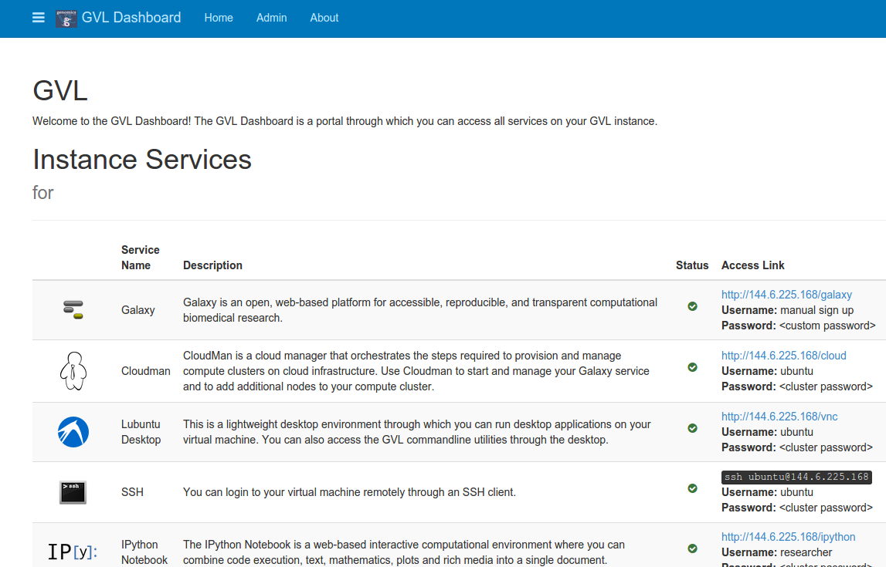

# Aligning genomes with Mauve

This tutorial assumes you have a Microbial GVL instance running already in the NeCTAR (or Amazon) cloud.
See the "[Initial setup](gvlsetup)" page for instructions on how to get that going.

Alternatively, these steps can be carried out on your personal computer running Linux, Windows or Mac OS X, though the individual steps may vary.

## Enter the Lubuntu interface

The Lubuntu interface is linked from the GVL dashboard web page:

It provides access to the linux desktop of the running GVL instance right inside the web browser. neat!

### Download Mauve for Linux

Mauve is available from [http://darlinglab.org/mauve](http://darlinglab.org/mauve).
To download & run Mauve:

1. click the menu icon in the lower-left corner and select Internet->Firefox web browser.
2. Navigate to the Mauve web site: http://darlinglab.org/mauve
3. Download the latest version of Mauve for Linux.
4. A window will pop up asking if you'd like to open it with the archive manager. Click Yes.
5. A new window will open showing a Mauve folder. Drag this out to the desktop somewhere.
6. Open that folder and double-click the "Mauve" script.
7. A window will appear asking if you would like to run the script. Click yes.

### Download the dataset

In this tutorial, we will compare a high quality reference genome (wildtype.gbk) to a closely related mutant genome. The mutant genome is the Prokka-annotated draft genome assembly, as generated in the previous tutorial steps.

To obtain the data:

1. Use firefox in the GVL machine to navigate to this tutorial page
2. Save the following two files to the desktop:

	[http://darlinglab.org/tutorials/data/wildtype.gbk](http://darlinglab.org/tutorials/data/wildtype.gbk)
	
	[http://darlinglab.org/tutorials/data/mutant.gbk](http://darlinglab.org/tutorials/data/mutant.gbk)

### Align the genomes with Mauve
1. Navigate back to, or re-launch Mauve
2. In the menu, select File->Align with progressiveMauve...
3. Add the two downloaded genome files
4. Give a name for the alignment in the "Output:" text box
5. Click "Align"

After a few minutes the genome alignment will finish and a display will appear which contains a visual representation of the genome alignment.
A description of the visualization interface is available in the [Mauve User Guide](http://darlinglab.org/mauve/user-guide/introduction.html)

